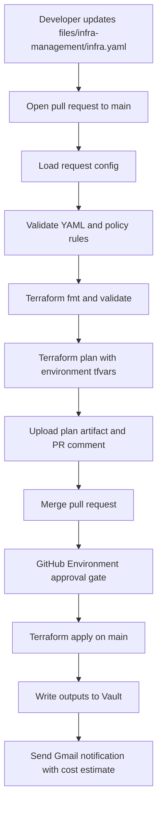
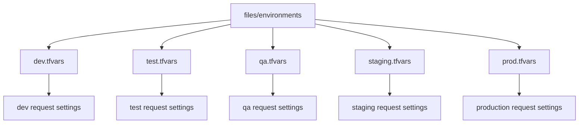

# Terraform Internal Developer Platform

This repository implements a GitHub-driven Internal Developer Platform (IDP) for Terraform. Developers submit a single [`infra.yaml`](./files/infra-management/infra.yaml) request, open a pull request, and the platform pipeline validates, plans, approves, and applies infrastructure through standardized Terraform modules.

## What The Platform Does

- Provisions tenant-scoped AWS infrastructure from one YAML request
- Enforces environment and sizing guardrails before Terraform runs
- Uses environment-specific `.tfvars` files from [`files/environments/`](./files/environments)
- Stores provisioned connection details in Vault
- Emails a provisioning summary with estimated monthly cost through Gmail
- Separates PR-time `plan` from post-merge `apply`
- Runs scheduled drift detection

## Supported Resources

The current implementation supports these optional resource blocks in [`files/infra-management/infra.yaml`](./files/infra-management/infra.yaml):

- `rds`: PostgreSQL, encrypted storage, backups, CloudWatch CPU alarm, Multi-AZ required in production
- `redis`: ElastiCache Redis, private subnet placement, CloudWatch CPU alarm
- `ec2`: encrypted root volume, IAM instance profile, detailed monitoring, optional backup snapshot, production backup enforcement
- `s3`: tenant bucket, versioning, lifecycle policy, encryption, public access block, IAM-restricted bucket policy

Every request also creates or uses:

- a tenant IAM role and instance profile
- a Vault secret path under `secret/idp/<environment>/<tenant>`
- a Gmail notification summarizing provisioned resources and estimated cost

## Current Pipeline Behavior

The workflow file is [`idp-pipeline.yml`](./.github/workflows/idp-pipeline.yml).

- `pull_request` to `main`
  - triggers when `files/infra-management/infra.yaml`, Terraform files, tfvars, scripts, or the workflow change
  - runs request loading, policy validation, `terraform fmt`, `terraform validate`, and `terraform plan`
  - uploads a plan artifact and comments the plan summary on the PR
- `push` to `main`
  - reruns request loading and validation
  - enforces the GitHub Environment approval gate
  - runs `terraform apply`
- `schedule`
  - runs daily drift detection at `0 2 * * *`
- `workflow_dispatch`
  - allows manual execution

## Request Flow



## Environment Model



## Example Request

```yaml
tenant_name: acme-corp
environment: staging
team_email: platform@acme.com
data_sensitivity: internal

resources:
  rds:
    enabled: true
    instance_class: db.t3.micro
    db_name: acmecorpdb
    multi_az: false
    backup_retention_days: 7

  redis:
    enabled: true
    node_type: cache.t3.micro
    num_nodes: 1

  ec2:
    enabled: false
    instance_type: t3.micro
    instance_count: 1
    backup_enabled: true

  s3:
    enabled: true
    versioning: true
    lifecycle_days: 90
```

## Guardrails Enforced Today

Validation is split between [`files/scripts/policy-check.sh`](./files/scripts/policy-check.sh) and Terraform preconditions in [`files/main.tf`](./files/main.tf).

- `tenant_name` must be lowercase and hyphenated
- `environment` must be one of `dev`, `test`, `qa`, `staging`, `production`
- `team_email` is required
- at least one resource must be enabled
- approved instance types are enforced for RDS, Redis, and EC2
- production RDS requires `multi_az: true`
- production EC2 requires `backup_enabled: true`
- at least two private subnet IDs must be supplied through environment tfvars

## Repository Layout

```text
.
├── .github/workflows/idp-pipeline.yml
├── README.md
├── e2e-sequence.md
├── env.md
├── governance-security.md
├── idp-provisioning-workflow.md
├── internal-tf-module-execution-layer.md
└── files
    ├── infra-management
    │   └── infra.yaml
    ├── main.tf
    ├── variables.tf
    ├── terraform.tfvars
    ├── environments
    │   ├── dev.tfvars
    │   ├── prod.tfvars
    │   ├── qa.tfvars
    │   ├── staging.tfvars
    │   └── test.tfvars
    ├── modules
    │   ├── ec2
    │   ├── iam
    │   ├── rds
    │   ├── redis
    │   ├── s3
    │   ├── gmail-notify
    │   └── vault-inject
    └── scripts
        └── policy-check.sh
```

## Required GitHub Secrets

- `AWS_ACCOUNT_ID`
- `TF_STATE_BUCKET`
- `TF_LOCK_TABLE`
- `VAULT_ADDRESS`
- `VAULT_TOKEN`
- `GMAIL_SENDER_EMAIL`
- `GMAIL_APP_PASSWORD`

## Environment Tfvars Inputs

Each file in [`files/environments/`](./files/environments) is expected to provide non-secret environment settings such as:

- `aws_region`
- `vpc_id`
- `private_subnet_ids`
- `default_ec2_ami_id`
- `default_rds_backup_retention_days`
- `allowed_rds_instance_classes`
- `allowed_redis_node_types`
- `allowed_ec2_instance_types`
- `monitor_alarm_actions`
- `global_tags`
- `rds_kms_key_id`
- `ec2_kms_key_id`
- `s3_kms_key_id`

## Notes About Current Implementation

- the root Terraform backend block contains placeholder values locally; the GitHub Actions workflow overrides backend settings during `terraform init`
- the workflow maps `production` requests to `files/environments/prod.tfvars`
- the repo includes additional design docs and Mermaid diagrams at the repository root
- raw Mermaid text does not render on GitHub; diagrams in this repo are now fenced with `mermaid` blocks for GitHub compatibility

## Additional Docs

- [`END_TO_END_EXPLANATION.md`](./END_TO_END_EXPLANATION.md)
- [`DEMO_SETUP.md`](./DEMO_SETUP.md)
- [`idp-provisioning-workflow.md`](./idp-provisioning-workflow.md)
- [`internal-tf-module-execution-layer.md`](./internal-tf-module-execution-layer.md)
- [`governance-security.md`](./governance-security.md)
- [`e2e-sequence.md`](./e2e-sequence.md)
- [`env.md`](./env.md)
