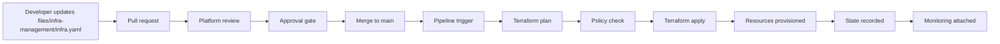

# End-To-End Sequence

```mermaid
flowchart LR
    DevRequest[Developer updates files/infra-management/infra.yaml] --> PR[Pull request]
    PR --> PlatformReview[Platform review]
    PlatformReview --> ApprovalGate[Approval gate]
    ApprovalGate --> MergeMain[Merge to main]
    MergeMain --> PipelineTrigger[Pipeline trigger]
    PipelineTrigger --> TerraformPlan[Terraform plan]
    TerraformPlan --> PolicyCheck[Policy check]
    PolicyCheck --> TerraformApply[Terraform apply]
    TerraformApply --> ResourceProvisioned[Resources provisioned]
    ResourceProvisioned --> StateRecorded[State recorded]
    StateRecorded --> MonitoringAttached[Monitoring attached]
```
