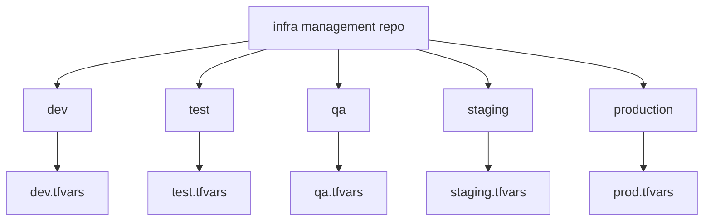

# Environment Mapping

This repository uses environments for deployment intent, defaults, and approval routing.

- `dev`
  Used for early development and fast iteration.
- `test`
  Used for integration and functional verification.
- `qa`
  Used for wider validation before release readiness.
- `staging`
  Used for production-like verification.
- `production`
  Used for real deployment with the strictest approval expectations.

Operational significance:

- the workflow reads `environment` from `files/infra-management/infra.yaml`
- that value selects the matching file in `files/environments/`
- `production` is mapped to `prod.tfvars`
- `dev`, `test`, `qa`, and `staging` map directly to same-name `.tfvars` files
- `production` routes through the `idp-production` GitHub Environment
- all other environments route through `idp-nonprod`
