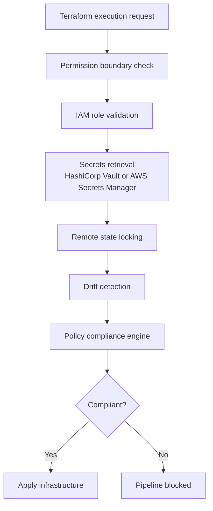

# Governance And Security

```mermaid
flowchart TD
    A[Terraform execution request] --> B[Permission boundary check]
    B --> C[IAM role validation]
    C --> D[Secrets retrieval<br/>HashiCorp Vault or AWS Secrets Manager]
    D --> E[Remote state locking]
    E --> F[Drift detection]
    F --> G[Policy compliance engine]
    G --> H{Compliant?}
    H -->|Yes| I[Apply infrastructure]
    H -->|No| J[Pipeline blocked]
```
