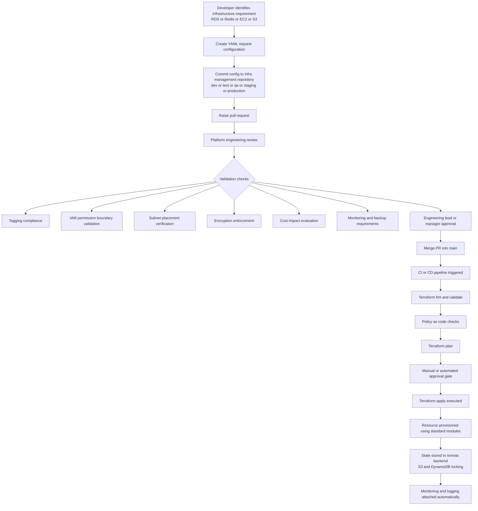

# IDP Provisioning Workflow

```mermaid
flowchart TD
    A[Developer identifies infrastructure requirement<br/>RDS or Redis or EC2 or S3] --> B[Create YAML request configuration]
    B --> C[Commit config to infra management repository<br/>dev or test or qa or staging or production]
    C --> D[Raise pull request]
    D --> E[Platform engineering review]
    E --> F{Validation checks}
    F --> F1[Tagging compliance]
    F --> F2[IAM permission boundary validation]
    F --> F3[Subnet placement verification]
    F --> F4[Encryption enforcement]
    F --> F5[Cost impact evaluation]
    F --> F6[Monitoring and backup requirements]
    F --> G[Engineering lead or manager approval]
    G --> H[Merge PR into main]
    H --> I[CI or CD pipeline triggered]
    I --> J[Terraform fmt and validate]
    J --> K[Policy as code checks]
    K --> L[Terraform plan]
    L --> M[Manual or automated approval gate]
    M --> N[Terraform apply executed]
    N --> O[Resource provisioned using standard modules]
    O --> P[State stored in remote backend<br/>S3 and DynamoDB locking]
    P --> Q[Monitoring and logging attached automatically]
```
