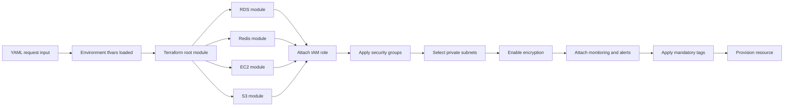

# Internal Terraform Module Execution Layer

```mermaid
flowchart LR
    A[YAML request input] --> B[Environment tfvars loaded]
    B --> C[Terraform root module]
    C --> D[RDS module]
    C --> E[Redis module]
    C --> F[EC2 module]
    C --> G[S3 module]
    D --> H[Attach IAM role]
    E --> H
    F --> H
    G --> H
    H --> I[Apply security groups]
    I --> J[Select private subnets]
    J --> K[Enable encryption]
    K --> L[Attach monitoring and alerts]
    L --> M[Apply mandatory tags]
    M --> N[Provision resource]
```
